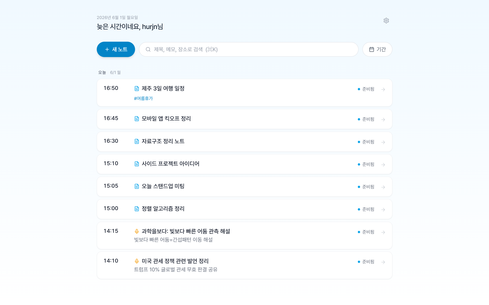
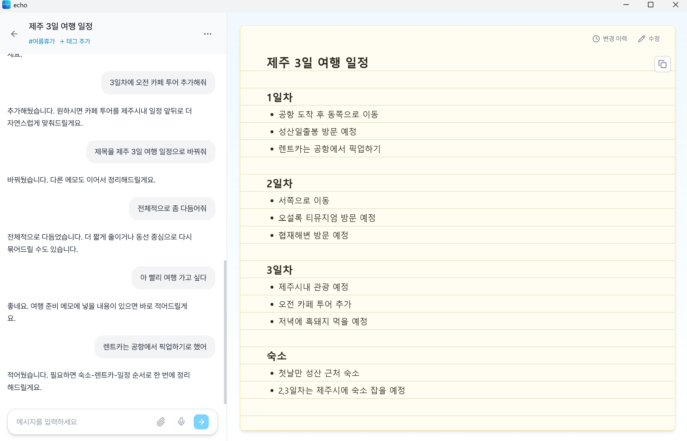
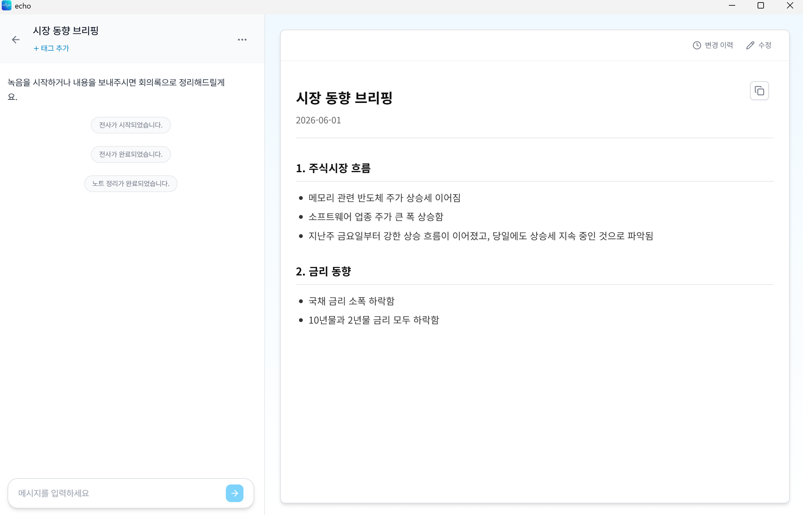

# echo

**녹음과 흩어진 생각을, 계속 다듬어 쓸 수 있는 노트로.**

[English](README.md) · [다운로드](https://github.com/JunNyung-Hur/echo/releases/latest) · [사용 가이드](docs/public/user-guide.md) · [변경 내역](docs/public/release-notes/README.md)

[](https://github.com/JunNyung-Hur/echo/actions/workflows/quality.yml)

echo는 회의, 강의, 인터뷰, 일상 메모를 위한 개인용 데스크톱 노트 앱입니다. 녹음하거나 음성 파일을 가져와 노트로 정리하고, 페이지 옆의 AI 에이전트에게 말하듯 요청해 내용을 다듬습니다. 노트와 녹음은 로컬에 저장되며, 처리에 사용할 AI 모델은 직접 연결합니다.



## 두 가지 노트 방식

| | 회의록형 · Minutes | 필기형 · Freeform |
|---|---|---|
| 시작 | 녹음 또는 음성 파일 가져오기 | 채팅 메모, 음성 녹음, 파일 첨부 |
| 정리 | 전사 후 구조화된 노트 생성 | 기존 노트에 내용을 계속 추가하고 정리 |
| 활용 | 회의, 강의, 인터뷰 | 프로젝트 메모, 아이디어, 일지 |
| 편집 | 요약, 정정, 구성 변경 요청 | 내용 추가, 섹션 정리, 세부 사항 수정 |

Markdown, 직접 편집, 버전 복원, 태그, 한국어·영어 UI를 지원합니다. 필기형에서는 Minimal, Notepad, Report, Colorful 중 노트 스타일을 선택할 수 있습니다.

## 0.0.5에서 달라진 점

현재 소스 버전은 **0.0.5**입니다. 빈 필기형 노트도 바로 작성할 수 있는 대상으로 안내합니다. 빈 노트 조회만으로 본문을 생성하지 않으며, 파일 손상이나 생성 중 상태와 구분합니다. [릴리스 내역](docs/public/release-notes/0.0.5.md)과 [설치 파일](https://github.com/JunNyung-Hur/echo/releases)을 확인하세요.

0.0.4에서 추가한 다음 기능도 유지됩니다.

- **원문을 확인하는 에이전트** — 현재 노트에 연결된 완료 전사록을 검색하고, 미리보기 밖의 구간도 읽어 답변과 편집에 활용합니다.
- **기존 내용을 보존하는 추가 작업** — 새 내용은 코드로 삽입하고, 기존 문구는 명시적인 편집으로 수정합니다. 에이전트가 읽은 버전이 오래됐으면 편집을 거절합니다.
- **성공한 구간을 재사용하는 전사 재시도** — 일부 구간이 실패하면 전체 녹음을 완료 처리하지 않습니다. 녹음과 ASR 설정이 같으면 재시도 시 성공한 구간의 결과를 재사용합니다.
- **조건과 미확정 사항을 유지하는 작성 지침** — 결정의 조건, 발언 정정, 담당자, 미해결 질문을 보존하고 입력에 맞춰 구성을 정하도록 프롬프트를 개선했습니다.
- **잘린 응답과 한글 스트리밍 처리 개선** — 네트워크 조각 경계에서 한글·이모지가 깨지지 않도록 처리하고, 불완전한 응답의 도구 호출은 실행하지 않습니다.

구조적인 실패 경로를 수정한 버전입니다. 실제 노트 품질은 녹음 상태와 연결한 ASR·LLM에 따라 달라지며, 실제 녹음에 대한 이전 버전과의 품질 비교는 아직 남아 있습니다.

## 시작하기

1. [최신 배포 버전](https://github.com/JunNyung-Hur/echo/releases/latest)에서 Windows x64용 `echo_<version>_x64-setup.exe`를 설치합니다. 릴리스 설치 파일에는 FFmpeg와 FFprobe가 포함됩니다.
2. **설정 → AI 모델**에서 엔드포인트를 등록하고 연결을 테스트한 뒤 활성화합니다.
3. 회의록형 또는 필기형 노트를 만들고 녹음·파일·메모를 추가합니다.

| 모델 | 용도 | 요구 사항 |
|---|---|---|
| LLM | 노트 생성과 에이전트 채팅 | OpenAI 호환 Chat Completions, 에이전트용 도구 호출 지원 |
| ASR | 녹음·음성 파일 전사 | 선택한 오디오 Chat Completions 또는 multipart Transcriptions 모드 지원 |

AI 모델과 API 사용료는 포함되지 않습니다. 클라우드 서비스 또는 호환되는 로컬 서버를 사용할 수 있으며, 실제 호환성은 모델과 요청 모드에 따라 달라집니다. 현재 배포 설치 파일과 데스크톱 CI 대상은 Windows x64입니다.

### 이렇게 요청해 보세요

- “이 음성 메모를 출시 계획 아래에 추가해줘.”
- “금요일 배포는 확정이야, 검토 통과 조건이야? 원문을 확인해줘.”
- “미해결 질문을 한곳에 모으고 나머지 섹션은 유지해줘.”
- “실패한 전사를 재시도해줘.”

채팅에서 도구 진행 상황과 편집 결과를 확인할 수 있습니다. 변경 카드를 펼쳐 수정 내용을 검토하고, **변경 이력**에서 이전 버전을 복원하세요.

| 필기형 노트 | 완성된 회의록 |
|---|---|
|  |  |

스크린샷은 기존 UI 기준이며, 현재 소스와 일부 문구가 다를 수 있습니다.

## 데이터와 현재 한계

- echo 계정이나 별도의 echo 서버는 필요하지 않습니다. 메타데이터는 로컬 SQLite에, 녹음·전사·본문은 로컬 앱 데이터 폴더에 저장됩니다.
- AI 처리에 필요한 오디오와 텍스트는 직접 설정한 엔드포인트로 전송됩니다. 클라우드 모델을 연결하면 해당 제공자에게 내용이 전달됩니다.
- 현재 버전의 API 키는 로컬에 평문으로 저장됩니다.
- 목록 검색은 제목·메모·장소·태그 대상입니다. 에이전트의 전사 검색은 현재 노트 안의 어휘 검색이며, 전체 노트 의미 검색과는 다릅니다.
- 실패한 작업 재개와 처음부터 다시 전사하기는 별도 동작입니다. 전체 재전사 시에는 확인 안내를 읽어 주세요.

## 개발과 검증

CI 기준은 **Node.js 22와 stable Rust**입니다. 데스크톱 실행에는 운영체제별 Tauri 의존성이 필요하며, 음성 개발에는 `PATH`에 FFmpeg와 FFprobe가 있어야 합니다.

```bash
npm ci
npm ci --prefix src-ui
npm run dev
```

GUI 의존성 없이 핵심 로직을 검사하려면 다음을 실행합니다.

```bash
cargo test --locked --manifest-path tools/core-check/Cargo.toml --lib
```

전체 빌드·테스트·Windows 설치 파일 생성 명령은 [영문 README](README.md#develop-and-verify)에 있습니다. 실제 모델 평가와 데스크톱 시나리오는 [검증 가이드](tools/core-check/README.md)를 참고하세요. CI 통과와 생성 노트의 품질 평가는 별개입니다.

## 문서와 라이선스

[문서 목차](docs/public/README.md) · [사용 가이드](docs/public/user-guide.md) · [아키텍처](docs/public/architecture.md) · [FAQ](docs/public/faq.md)

echo는 [Apache-2.0](LICENSE) 라이선스입니다. [NOTICE](NOTICE)와 [서드파티 고지](THIRD-PARTY-NOTICES.md)에서 FFmpeg 배포 및 저작권 정보를 확인할 수 있습니다.
