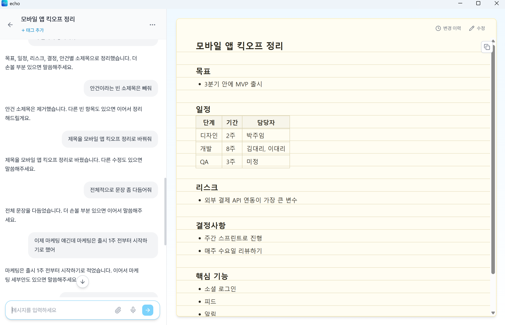
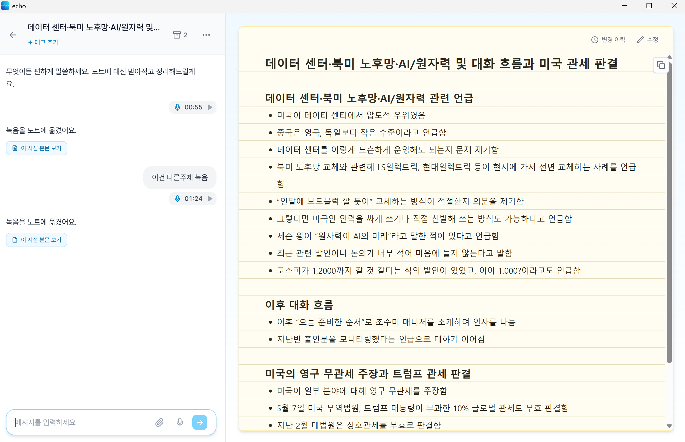
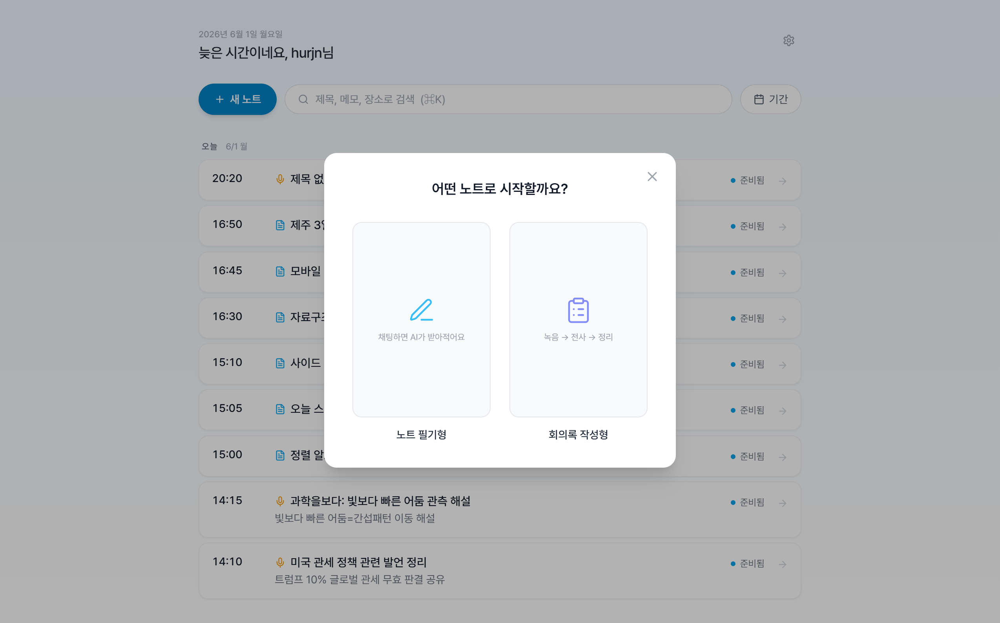
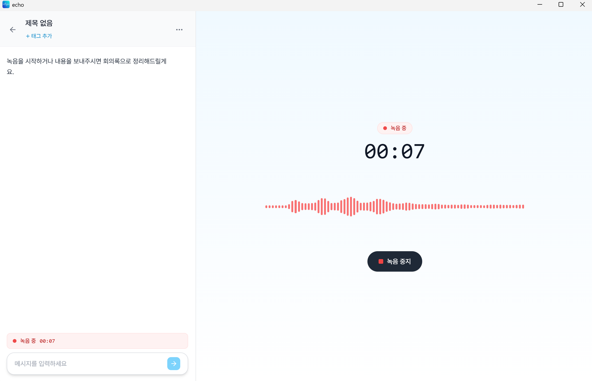
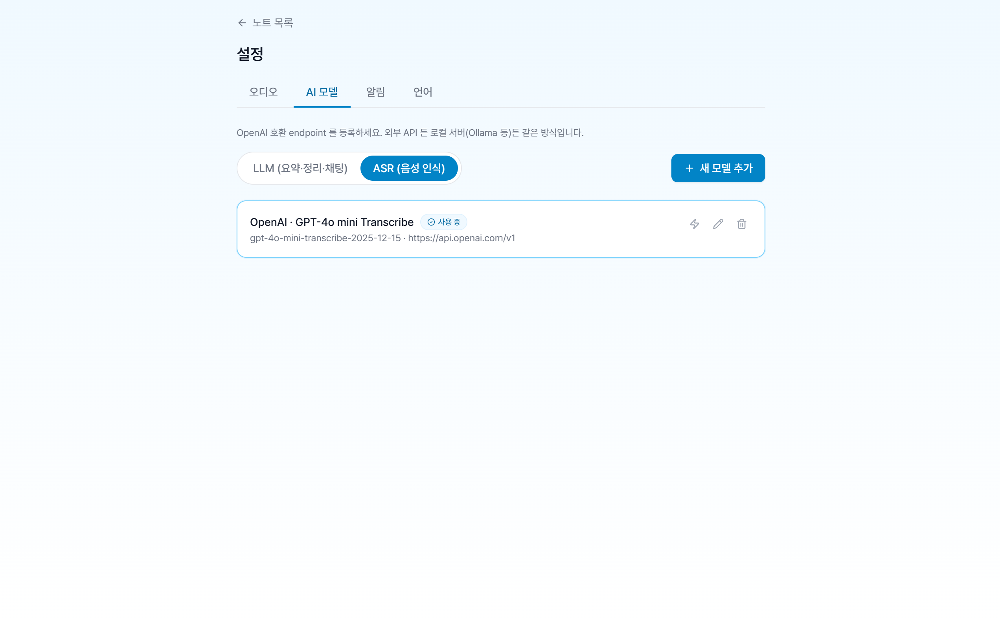
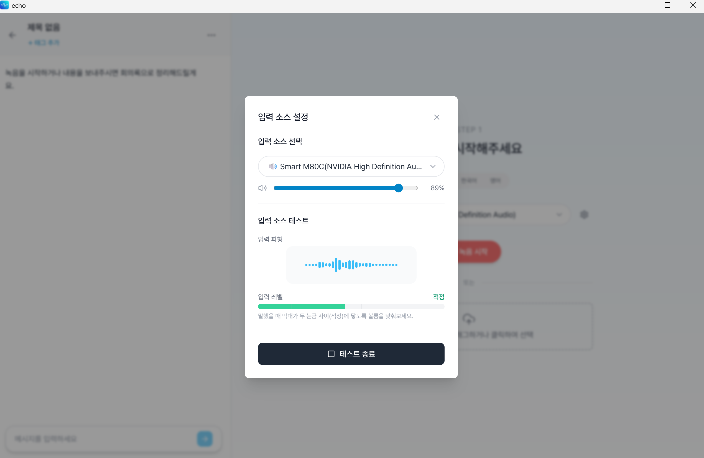

# echo

**Turn recordings and rough thoughts into notes you can keep working on.**

[한국어](README.ko.md) · [Download](https://github.com/JunNyung-Hur/echo/releases/latest) · [User guide](docs/public/user-guide.md) · [Release notes](docs/public/release-notes/README.md)

[](https://github.com/JunNyung-Hur/echo/actions/workflows/quality.yml)

echo is a personal desktop notebook for meetings, lectures, interviews, and everyday ideas. Record audio or import a file, turn it into a structured note, then refine it through a conversation beside the page. Your notes and recordings are stored locally; you choose the AI endpoints that process them.


## Choose how you take notes

| | Minutes | Freeform |
|---|---|---|
| Start with | A recording or an audio file | A typed memo, voice recording, or audio attachment |
| Build the note | Transcribe, then generate a structured write-up | Add material to a note over time through chat |
| Use it for | Meetings, lectures, interviews | Project notes, ideas, personal journals |
| Refine it | Correct details, summarize, or change the structure | Add content, organize sections, and correct details |

Both support Markdown, manual editing, version history, tags, and a Korean / English interface. Freeform notes also have four visual styles: Minimal, Notepad, Report, and Colorful.

## What changed in 0.0.6

This source tree targets **0.0.6**. Request continuity now distinguishes individual tool results from overall completion, and links text, notes and recording evidence across turns. This release also fixes interrupted multi-part requests, model temperature compatibility, and adds GPT-5.6 choices. See the [release notes](docs/public/release-notes/0.0.6.md) for changes and verification limits, and [GitHub Releases](https://github.com/JunNyung-Hur/echo/releases) for installers.

The following improvements from 0.0.4 remain available:

- **An agent that can consult the recording's text.** It can search completed transcripts attached to the current note and read passages beyond the preview when answering or editing.
- **Additions that preserve the existing note.** New freeform content is inserted directly. Changes to existing text use explicit edits, with version checks that reject stale agent edits.
- **Retries that keep successful transcription work.** A failed audio chunk prevents the recording from being marked complete. Retrying reuses successful chunks when the recording and ASR settings match.
- **More faithful note-writing instructions.** The prompt asks the model to retain conditions, corrections, attribution, and unresolved points, and to adapt the structure to the source.
- **Stricter response handling.** Korean and emoji survive split network packets; malformed or truncated responses are rejected before their tool calls are executed.

These changes address specific failure paths. Generated-note quality still depends on the audio, transcription model, and language model; a real-recording quality comparison remains pending.

## Get started

### Install on Windows x64

1. Download `echo_<version>_x64-setup.exe` from [the latest published release](https://github.com/JunNyung-Hur/echo/releases/latest).
2. Run the installer. Release installers bundle FFmpeg / FFprobe and install WebView2 if needed.
3. Open **Settings → AI models**, register your endpoints, test the connections, and activate the endpoints you want to use.

| Endpoint | Needed for | Compatibility |
|---|---|---|
| LLM | Generating notes and using the chat agent | OpenAI-compatible Chat Completions; the agent needs tool calling |
| ASR | Transcribing recorded or imported audio | The selected audio Chat Completions or multipart Transcriptions request mode |

Models and API credits are not included. You can use a cloud provider or a compatible local server. Compatibility depends on the selected model and request mode, not only the server's name.

Windows x64 is the published installer target. Linux and macOS desktop builds are not covered by the current Windows CI; the core test suite below does not require the desktop GUI.

### Try these requests

- “Add this voice memo under the launch plan.”
- “Was Friday a confirmed deadline or conditional on the review? Check the transcript.”
- “Group the open questions together and keep the other sections.”
- “Retry the failed transcription.”

Chat shows tool progress and edit results. Expand edit cards to review changes, and use **History** to restore an earlier note version. See the [user guide](docs/public/user-guide.md) for the complete workflow.

## Screenshots

| Freeform note | Completed minutes |
|---|---|
|  |  |

<details>
<summary>Note styles, recording, and settings</summary>

| Note style | Another style |
|---|---|
|  |  |

| Choose a note type | Recording |
|---|---|
|  |  |

| AI settings | Audio input test |
|---|---|
|  |  |

</details>

Screenshots show the existing interface; some labels may differ from the current source version.

## Data and current limits

- No echo account or hosted echo backend is required. Metadata lives in SQLite; recordings, transcripts, and note bodies live in the local app-data folder.
- Audio and text are sent to the endpoints you configure. Using a cloud model sends the relevant content to that provider.
- API keys are stored locally in plaintext in this version.
- Note-list search covers titles, memos, locations, and tags. The agent's transcript search is separate, uses lexical matching, and stays within the current note; it is not a whole-library semantic search.
- Explicit full re-transcription is different from resuming a failed task. Review its confirmation before replacing existing work.

## Develop and verify

Use **Node.js 22** and **stable Rust**, matching [Windows CI](.github/workflows/quality.yml). Native development also requires the platform's Tauri dependencies. On Windows, use the MSVC build tools and Windows SDK. Install FFmpeg and FFprobe on your `PATH` for audio development.

From the repository root:

```bash
npm ci
npm ci --prefix src-ui
npm run dev
```

Run the checks used by CI:

```bash
npm run build --prefix src-ui
cargo test --locked --manifest-path tools/core-check/Cargo.toml --lib
cargo test --locked --manifest-path src-tauri/Cargo.toml --lib
cargo check --locked --manifest-path src-tauri/Cargo.toml
```

The core suite imports production source directly and runs without Tauri's desktop GUI dependencies. It covers transport, Unicode, transcript scope, editing, version conflicts, and retry state. The desktop suite separately compiles and tests the application.

Real-model tests are opt-in and require your endpoints. See [quality evaluation](tools/core-check/README.md) for fixtures, commands, and the UI scenarios required before release. Passing CI is not a measure of generated-note quality.

### Build a Windows installer

Place the required FFmpeg / FFprobe binaries in `src-tauri/binaries/` following [the bundled-binary instructions](src-tauri/binaries/README.md), then run:

```bash
npx tauri build --config src-tauri/tauri.release.conf.json
```

Installers are written under `src-tauri/target/release/bundle/`. The release overlay includes audio binaries; normal development does not require those bundled files.

## Project map

| Path | Purpose |
|---|---|
| `src-ui/` | React, TypeScript, Vite, and Tailwind interface |
| `src-tauri/src/chat/` | Agent loop, source tools, and note editing |
| `src-tauri/src/worker/` | Audio finalization, transcription, and note generation |
| `src-tauri/migrations/` | SQLite schema migrations |
| `tools/core-check/` | Core regression tests and opt-in quality evaluation |
| `docs/public/` | User guide, architecture, requirements, and release history |

[Documentation index](docs/public/README.md) · [Architecture](docs/public/architecture.md) · [FAQ](docs/public/faq.md)

## License

echo is licensed under [Apache-2.0](LICENSE). See [NOTICE](NOTICE) and [third-party notices](THIRD-PARTY-NOTICES.md) for attribution and the FFmpeg distribution details.
