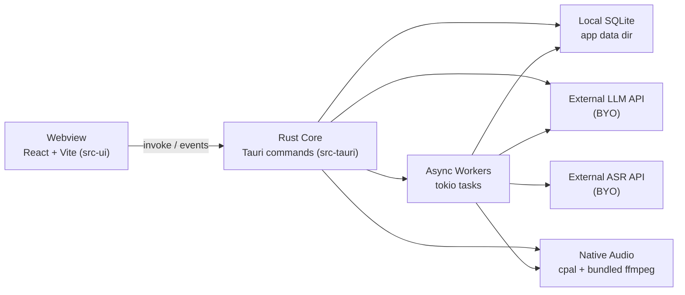
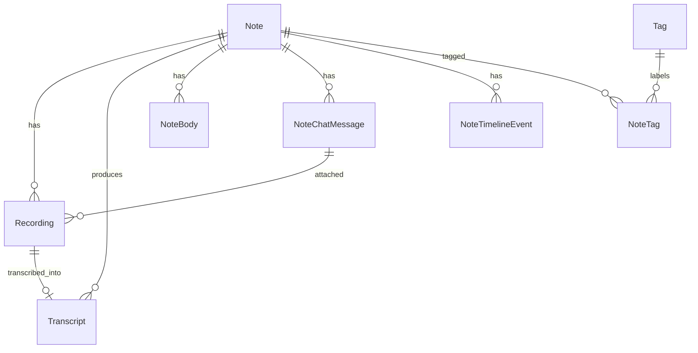
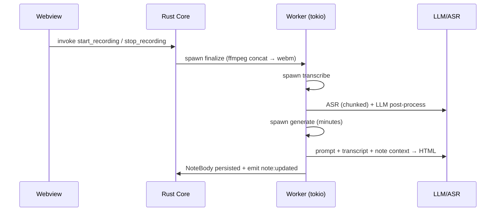
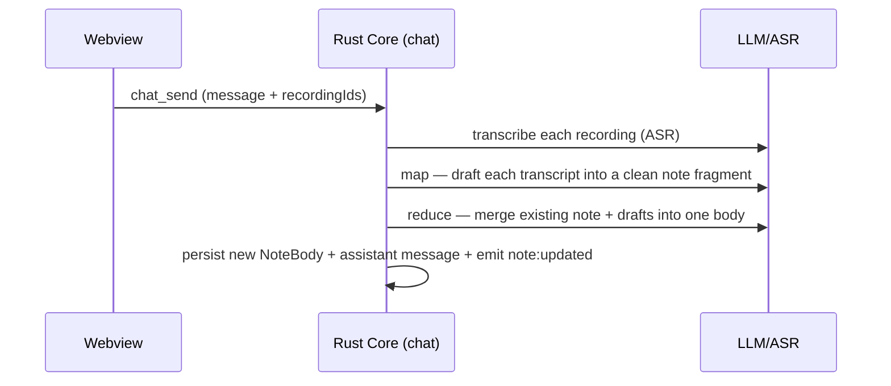

# echo — Architecture

A share-level overview of echo's structure, data, and runtime. echo is a single-user desktop app that runs on your laptop with no account or server.

---

## 1. System overview

echo is a Tauri v2 desktop app. A React frontend (webview) and a Rust backend talk over IPC inside one native app; data lives in local SQLite, and heavy work runs on async workers. AI calls go to external OpenAI-compatible endpoints you register.



The frontend calls Rust commands via `@tauri-apps/api`'s `invoke()`, and receives worker progress through Tauri events (`note:updated`, `chat:status`, `chat:delta`, …). ffmpeg/ffprobe are invoked as separate processes (bundled in release builds, PATH fallback in dev).

| Component | Role |
|---|---|
| `src-ui/` (webview) | React screens — note list/detail, chat, settings |
| `src-tauri/` core | Tauri commands (IPC boundary), repos (sqlx), chat agent, worker dispatch |
| Workers (tokio) | finalize → transcribe → generate (minutes) / map-reduce (freeform) |
| Native audio | cpal capture, ffmpeg conversion |
| External LLM·ASR | OpenAI-compatible endpoints registered in Settings |

---

## 2. Tech stack

| Layer | Stack |
|---|---|
| App shell | Tauri v2 (wry webview, system tray) |
| Frontend | React, TypeScript, Vite, Tailwind CSS, react-markdown |
| Backend | Rust, sqlx (SQLite, async), tokio, serde |
| Storage | Local SQLite (app data dir) |
| Audio | cpal (native capture), bundled ffmpeg (LGPL, audio only) |
| AI | OpenAI-compatible LLM·ASR endpoints (bring-your-own) |

---

## 3. Data model

The schema is defined in `src-tauri/migrations/` and mapped to row models in `src-tauri/src/models.rs`.



| Table | Role |
|---|---|
| `notes` | Note meta. `note_type` = `minutes` / `freeform` (chosen at creation). Title is derived from the body's first line. |
| `recordings` | Recording file meta. `format` is a state machine (`recording`/`finalizing`/`webm`/…), `last_chunk_at` is a heartbeat. `consumed_at` marks a freeform attachment that's been sent; `chat_message_id` links it to the chat message that sent it (bubble chips). |
| `transcripts` | ASR + post-processed output (raw/corrected). |
| `note_bodies` | The organized note body (HTML on disk). `context_snapshot` (JSON) captures meta at generation time; `archived` keeps old versions (history); `is_manual_edit` flags hand edits. |
| `note_chat_messages` | Left-side chat. Assistant rows carry `tool_calls` (JSON) and `note_body_version_id` (which version a turn produced). |
| `note_timeline_events` | Lifecycle moments (record/transcribe/generate) shown as system pills in the chat. |
| `tags` / `note_tags` | Hashtags + note M2M (name NOCASE unique, FK CASCADE). |
| `ai_endpoints` / `settings` | LLM·ASR endpoint config, app settings (KV). |

---

## 4. Key flows

### 4.1 Minutes: record → transcribe → generate



Minutes generation runs once, automatically, when a minutes note is first recorded/imported.

### 4.2 Freeform: chat + attached audio (map-reduce)

A freeform note is built by chatting. The agent's `write_note` tool writes/refines the note body (append / tidy / restructure). When a chat message carries attached recordings, the send path:



The existing note is one of the merge inputs, so its content is preserved; different topics are split into sections. (freeform transcription does **not** trigger minutes generation.)

### 4.3 Chat agent (refinement)

For text-only turns the agent runs a tool loop. Design points:

- **Tools**: `write_note` (freeform body), `refine_minutes` (minutes body), `read_transcript` (only on explicit request), `retry_transcribe`, `retry_failed_task`, `get_recording_download_url`. Tools are dynamically gated by stage and `user_state.available_actions` so the agent can't do what the screen can't.
- **System prompt** (`src-tauri/src/chat/prompt.rs`) is a section registry + IF/THEN rules, refilled each request with note state and the user's visible state. Guards against paraphrasing, oversharing, and inventing tools.
- **Output language** is decided from the `ui_lang` setting + the message's script, and pinned at the top of the prompt.
- **Long-running tools** (`refine_minutes`, `retry_*`) run only on an explicit instruction; status questions get a one-line suggestion instead.

---

## 5. Extension points

### External LLM·ASR

Core (chat) and workers call OpenAI-compatible APIs. Base URL, API key, and model id live in the `ai_endpoints` table, read just before each call. `request_mode` distinguishes `chat_completions` (audio_url style) from `transcriptions` (multipart).

### Desktop integration

- System tray menu: **Open** and **Quit**.
- Closing the main window hides to the tray (the app keeps running); quit from the tray.
- Recordings orphaned by an app crash are auto-recovered on the next launch.

---

## 6. Build & run

```bash
npm install                  # root: Tauri CLI
npm --prefix src-ui install  # frontend deps
npm run dev                  # tauri dev (vite + cargo + app)

# Release installer (bundles ffmpeg via the overlay config):
npx tauri build --config src-tauri/tauri.release.conf.json
```

- `tauri.conf.json`: `frontendDist: ../src-ui/dist`, migrations applied on startup, DB at `…/com.echo.app/echo.db`.
- ffmpeg/ffprobe: bundled in release builds (`src-tauri/binaries/`, LGPL); dev uses `ffmpeg` on PATH.

---

## 7. Invariants worth knowing

1. **Domain term is "note"** — meeting→note, minutes→note_body. Kept consistent across prompt and UI.
2. **Minutes generation is not auto-re-triggered** — protects hand edits and accumulated effects; changes go through refinement.
3. **Transcript is immutable** — nothing but transcribe mutates a transcript.
4. **Single-commit task dispatch** — task_id + a `processing` row + spawn are one transaction to avoid races (G-TASK-001).
5. **One chat turn = one row** — tool_calls + note_body_version_id ride the natural-language reply row so "Open this version" lands correctly.
6. **Timeline is a separate table** — merged chronologically into the chat by the frontend.
7. **Existing content is preserved on freeform merge** — the prior note body is a merge input, never overwritten wholesale.
