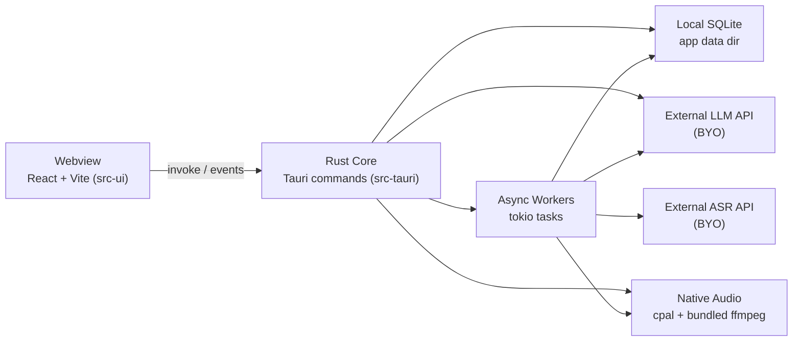
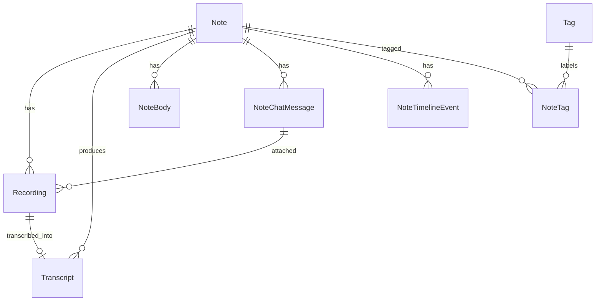
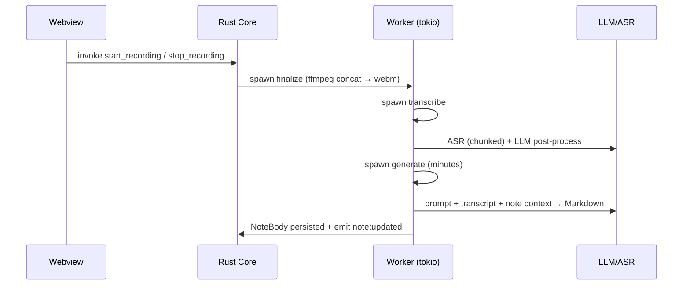
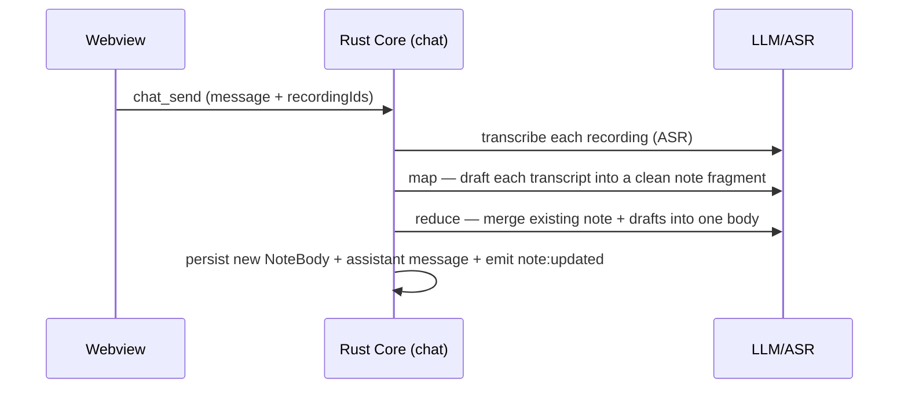

# echo — Architecture

A share-level overview of echo's structure, data, and runtime. echo is a single-user desktop app that runs on your laptop with no account or server.

---

## 1. System overview

echo is a Tauri v2 desktop app. A React frontend (webview) and a Rust backend talk over IPC inside one native app; data lives in local SQLite, and heavy work runs on async workers. AI calls go to external OpenAI-compatible endpoints you register.


```mermaid
graph LR
    UI["Webview<br/>React + Vite (src-ui)"]
    Core["Rust Core<br/>Tauri commands (src-tauri)"]
    DB["Local SQLite<br/>app data dir"]
    Worker["Async Workers<br/>tokio tasks"]
    Audio["Native Audio<br/>cpal + bundled ffmpeg"]
    LLM["External LLM API<br/>(BYO)"]
    ASR["External ASR API<br/>(BYO)"]

    UI -->|invoke / events| Core
    Core --> DB
    Core --> Worker
    Core --> Audio
    Core --> LLM
    Worker --> DB
    Worker --> LLM
    Worker --> ASR
    Worker --> Audio
```

The frontend calls Rust commands via `@tauri-apps/api`'s `invoke()`, and receives worker progress through Tauri events (`note:updated`, `chat:status`, `chat:delta`, …). ffmpeg/ffprobe are invoked as separate processes (bundled in release builds, PATH fallback in dev).

| Component | Role |
|---|---|
| `src-ui/` (webview) | React screens — note list/detail, chat, settings |
| `src-tauri/` core | Tauri commands (IPC boundary), repos (sqlx), chat agent, worker dispatch |
| Workers (tokio) | finalize → transcribe → generate (minutes) / map-reduce (freeform) |
| Native audio | cpal capture, ffmpeg conversion |
| External LLM·ASR | OpenAI-compatible endpoints registered in Settings |

---

## 2. Tech stack

| Layer | Stack |
|---|---|
| App shell | Tauri v2 (wry webview, system tray) |
| Frontend | React, TypeScript, Vite, Tailwind CSS, react-markdown |
| Backend | Rust, sqlx (SQLite, async), tokio, serde |
| Storage | Local SQLite (app data dir) |
| Audio | cpal (native capture), bundled ffmpeg (LGPL, audio only) |
| AI | OpenAI-compatible LLM·ASR endpoints (bring-your-own) |

---

## 3. Data model

The schema is defined in `src-tauri/migrations/` and mapped to row models in `src-tauri/src/models.rs`.


```mermaid
erDiagram
    Note ||--o{ Recording : has
    Note ||--o{ Transcript : produces
    Note ||--o{ NoteBody : has
    Note ||--o{ NoteChatMessage : has
    Note ||--o{ NoteTimelineEvent : has
    Note ||--o{ NoteTag : tagged
    Tag ||--o{ NoteTag : labels
    Recording ||--o| Transcript : transcribed_into
    NoteChatMessage ||--o{ Recording : attached
```

| Table | Role |
|---|---|
| `notes` | Note meta. `note_type` = `minutes` / `freeform` (chosen at creation). `theme` is the note-style preset (freeform; minutes keep a fixed look). Title is derived from the body's first `#` heading / line. |
| `recordings` | Recording file meta. `format` is a state machine (`recording`/`finalizing`/`webm`/…), `last_chunk_at` is a heartbeat. `consumed_at` marks a freeform attachment that's been sent; `chat_message_id` links it to the chat message that sent it (bubble chips). |
| `transcripts` | ASR + post-processed output (raw/corrected). |
| `note_bodies` | The organized note body (Markdown on disk; pre-v0.0.3 bodies are HTML and still render). `context_snapshot` (JSON) captures meta at generation time; `archived` keeps old versions (history); `is_manual_edit` flags hand edits; `refine_request` records the user request behind an agent edit. |
| `note_chat_messages` | Left-side chat. Assistant rows carry order-preserving `parts` (JSON `[text/tool/ask]` blocks — the source for step cards and history replay), legacy `tool_calls`, and `note_body_version_id`. |
| `note_timeline_events` | Lifecycle moments (record/transcribe/generate) shown as system pills in the chat. |
| `tags` / `note_tags` | Hashtags + note M2M (name NOCASE unique, FK CASCADE). |
| `ai_endpoints` / `settings` | LLM·ASR endpoint config, app settings (KV). |

---

## 4. Key flows

### 4.1 Minutes: record → transcribe → generate


```mermaid
sequenceDiagram
    participant UI as Webview
    participant Core as Rust Core
    participant W as Worker (tokio)
    participant AI as LLM/ASR

    UI->>Core: invoke start_recording / stop_recording
    Core->>W: spawn finalize (ffmpeg concat → webm)
    W->>W: spawn transcribe
    W->>AI: ASR (chunked) + LLM post-process
    W->>W: spawn generate (minutes)
    W->>AI: prompt + transcript + note context → Markdown
    W->>Core: NoteBody persisted + emit note:updated
```

Minutes generation runs once, automatically, when a minutes note is first recorded/imported.

### 4.2 Freeform: chat + attached audio (map-reduce)

A freeform note is built by chatting. The agent's `write_note` tool writes/refines the note body (append / tidy / restructure). When a chat message carries attached recordings, the send path:


```mermaid
sequenceDiagram
    participant UI as Webview
    participant Core as Rust Core (chat)
    participant AI as LLM/ASR

    UI->>Core: chat_send (message + recordingIds)
    Core->>AI: transcribe each recording (ASR)
    Core->>AI: map — draft each transcript into a clean note fragment
    Core->>AI: reduce — merge existing note + drafts into one body
    Core->>Core: persist new NoteBody + assistant message + emit note:updated
```

The existing note is one of the merge inputs, so its content is preserved; different topics are split into sections. (freeform transcription does **not** trigger minutes generation.)

### 4.3 Chat agent (single-session, talker = doer)

Text turns run a single continuous tool loop — the agent *is* the editor, not a dispatcher. Design points:

- **View → edit**: the note body is never inlined in the system prompt. The agent calls `read_minutes` for the current body, then `edit_minutes` applies **str_replace edits** (`{old, new, replace_all}`) with guards — unique match (whitespace-tolerant fallback), reject no-op / comment-only changes. Guard failures return as retryable tool errors, so the model naturally retries with a corrected snippet. Each successful edit becomes a new `note_bodies` version with a red/green diff shown in chat.
- **Tools**: `read_minutes` / `edit_minutes` (minutes + freeform edits), `write_note` (freeform dictation / tidy / restructure), `set_theme` (freeform note style), `ask_user`, `read_transcript` (only on explicit request), `retry_transcribe`, `retry_failed_task`, `get_recording_download_url`. Gated by stage and `user_state.available_actions` so the agent can't do what the screen can't.
- **`ask_user` hard-stops the turn**: when a choice is genuinely ambiguous (or destructive, like re-transcribe) the agent asks with option buttons and the loop ends — structurally preventing ask-then-answer-yourself behavior.
- **Parts model**: one user send = one assistant row whose `parts` array preserves the real order of text / tool calls / questions. History is serialized back in that order (a completion report never precedes its tool call), and stale tool results are pruned (only the last `read_minutes` keeps its body).
- **System prompt** (`src-tauri/src/chat/prompt.rs`) is a section registry + IF/THEN rules plus honesty/turn rules (no pre-call narration, no claiming unfinished work), refilled each request with note state and the user's visible state.
- **Output language** is decided from the `ui_lang` setting + the message's script, and pinned at the top of the prompt.
- **Long-running tools** (`retry_*`) run only on an explicit instruction; status questions get a one-line suggestion instead. A runaway LLM stream is cut off by a size backstop, and whole-body freeform rewrites are rejected if they would lose existing content.

---

## 5. Extension points

### External LLM·ASR

Core (chat) and workers call OpenAI-compatible APIs. Base URL, API key, and model id live in the `ai_endpoints` table, read just before each call. `request_mode` distinguishes `chat_completions` (audio_url style) from `transcriptions` (multipart).

### Desktop integration

- System tray menu: **Open** and **Quit**.
- Closing the main window hides to the tray (the app keeps running); quit from the tray.
- Recordings orphaned by an app crash are auto-recovered on the next launch.

---

## 6. Build & run

```bash
npm install                  # root: Tauri CLI
npm --prefix src-ui install  # frontend deps
npm run dev                  # tauri dev (vite + cargo + app)

# Release installer (bundles ffmpeg via the overlay config):
npx tauri build --config src-tauri/tauri.release.conf.json
```

- `tauri.conf.json`: `frontendDist: ../src-ui/dist`, migrations applied on startup, DB at `…/com.echo.app/echo.db`.
- ffmpeg/ffprobe: bundled in release builds (`src-tauri/binaries/`, LGPL); dev uses `ffmpeg` on PATH.

---

## 7. Invariants worth knowing

1. **Domain term is "note"** — meeting→note, minutes→note_body. Kept consistent across prompt and UI.
2. **Minutes generation is not auto-re-triggered** — protects hand edits and accumulated effects; changes go through in-place agent edits (str_replace), never whole-body regeneration.
3. **Transcript is immutable** — nothing but transcribe mutates a transcript.
4. **Single-commit task dispatch** — task_id + a `processing` row + spawn are one transaction to avoid races (G-TASK-001).
5. **One user send = one assistant row** — the `parts` array carries the ordered text/tool/ask blocks; history replay preserves that order so the model never learns to report before calling.
6. **Timeline is a separate table** — merged chronologically into the chat by the frontend.
7. **Existing content is preserved on freeform merge** — the prior note body is a merge input, never overwritten wholesale.
