# echo — User Guide

echo is a personal Second Brain desktop app. Capture anything — a meeting, a lecture, a quick memo, thinking out loud — and an AI agent beside your note transcribes it and organizes it into clean notes that you grow and refine by chatting. It's a single-user app — no account, no server.

#### Contents

1. [Install & first-run setup](#1-install--first-run-setup)
2. [The note list](#2-the-note-list)
3. [Creating a note — two types](#3-creating-a-note--two-types)
4. [Freeform notes (chat-first)](#4-freeform-notes-chat-first)
5. [Minutes notes (record a meeting)](#5-minutes-notes-record-a-meeting)
6. [The note header (title & tags)](#6-the-note-header-title--tags)
7. [Asking the AI agent](#7-asking-the-ai-agent)
8. [Viewing, editing & version history](#8-viewing-editing--version-history)
9. [Tags](#9-tags)
10. [Search](#10-search)
11. [Settings (AI models · language · audio)](#11-settings-ai-models--language--audio)
12. [FAQ](#12-faq)

---

## 1. Install & first-run setup

echo is a desktop app you install on your laptop. There's no login or account; your data is stored locally on your device.

1. Download and run **`echo_<version>_x64-setup.exe`**.
2. **ffmpeg is bundled** — echo ships its own ffmpeg/ffprobe, so you don't need to install anything for audio. WebView2 is installed automatically if missing (Windows 11 already has it).

On first launch you go through a short setup:

1. **Language** — Korean / English. This becomes the default for both the app UI and the AI output language (changeable later in Settings).
2. **Register your AI models** — echo doesn't bundle any AI; you connect your own OpenAI-compatible endpoints. Register one for transcription (**ASR**) and one for organizing/chat (**LLM**). A cloud API key or a local server (vLLM, etc.) both work, the same way.

> Until both endpoints are set, recording/transcription and note generation can't run.

---

## 2. The note list

Opening the app shows the **My Notes** page: a time-appropriate greeting and today's date at the top, with your notes below as a chronological agenda grouped by date.

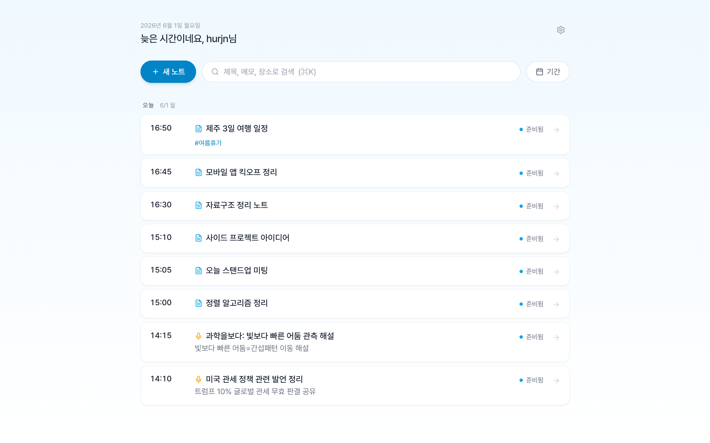

- **New note** is the sky-colored button at the top.
- A small icon in front of each title shows the note's type — a mic for **Minutes**, a page for **Freeform**.
- **Search**: type keywords (title / memo / location) or a `#tag` to narrow down. `Ctrl+K` focuses the search bar.
- **Date filter**: set start/end dates in the *date* chip.
- With no notes yet, you'll see an illustration inviting you to start your first one.

---

## 3. Creating a note — two types

Press **New note** and pick what kind of note this is:

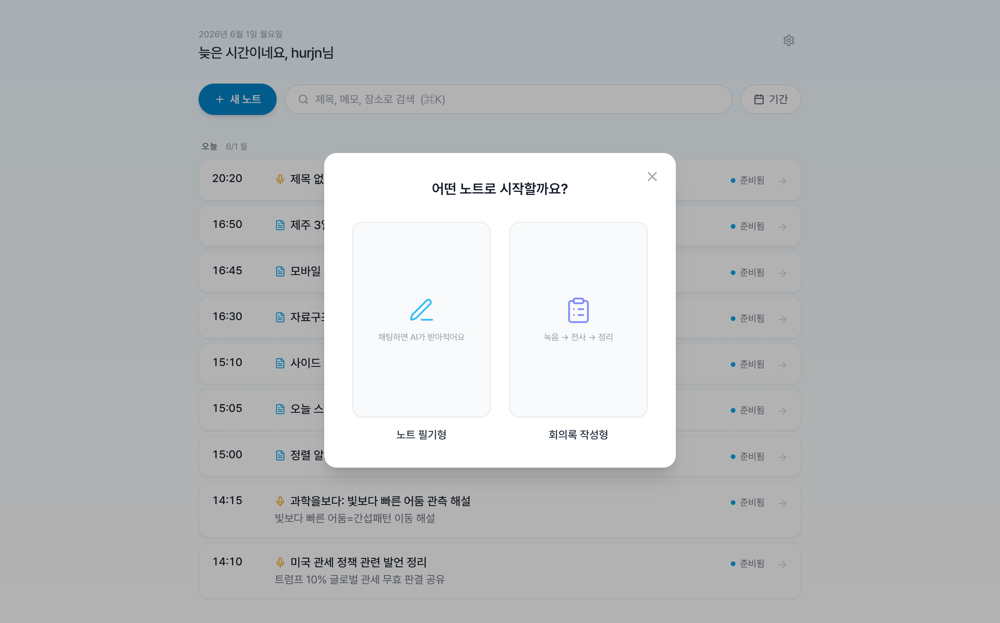

- **Minutes** — record a meeting, lecture, or interview; echo transcribes it and generates a structured write-up.
- **Freeform** — a chat-first notepad you build up over time, by typing and by attaching voice/audio.

The type is chosen once per note. The two flows are described next.

---

## 4. Freeform notes (chat-first)

A freeform note is a notepad (the page on the right) with an AI agent chat beside it. You grow the note two ways: by **typing in the chat**, and by **attaching voice or audio** that echo transcribes into it.

| | | |
|:-:|:-:|:-:|
| 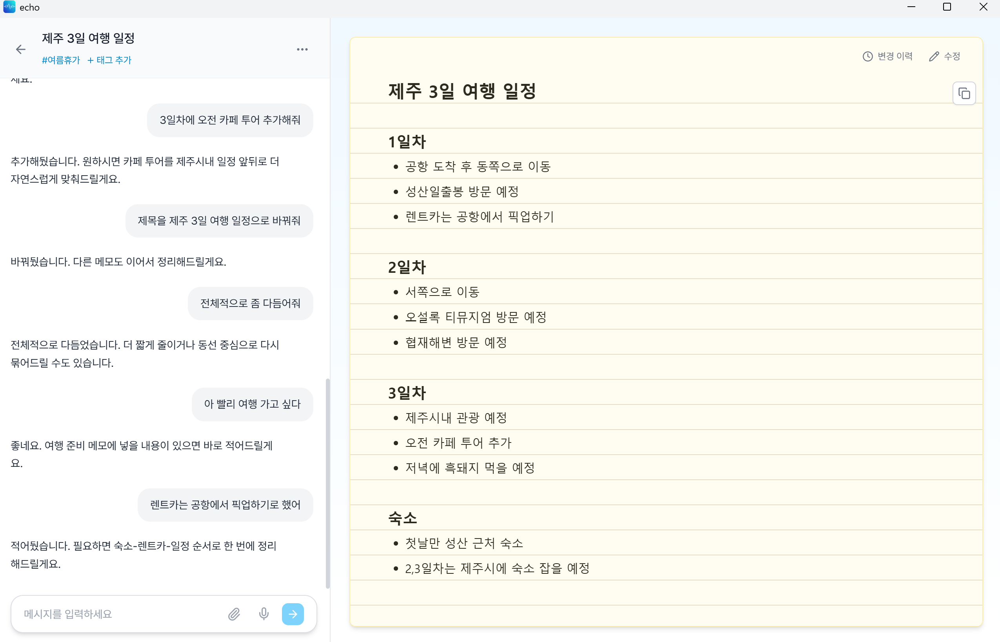 | 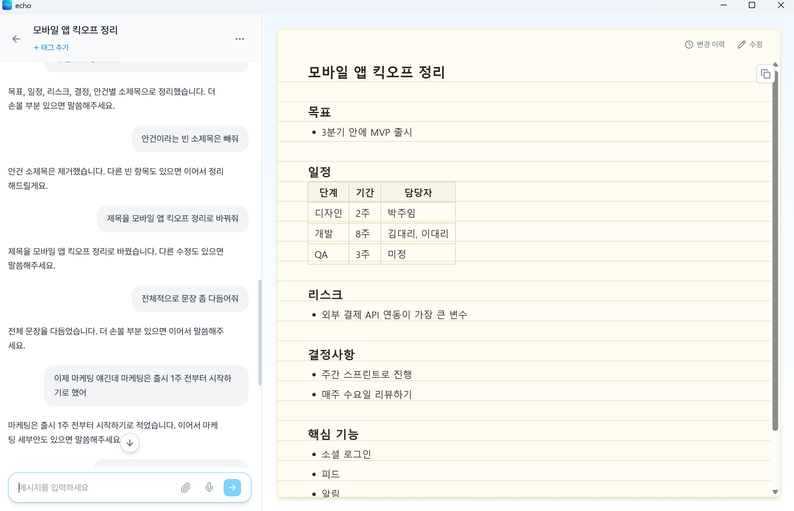 | 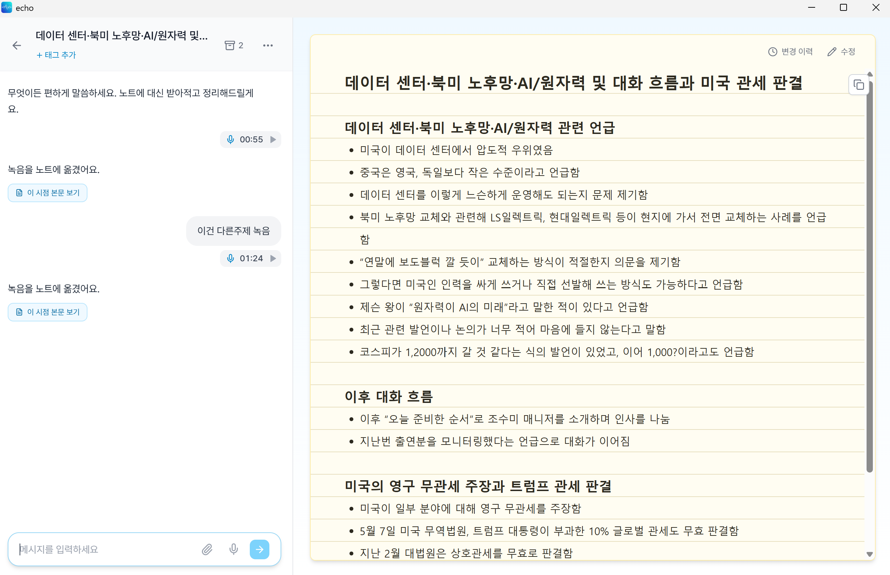 |

### 4.1 Writing by chat

Type what you want to note and send it. The agent writes it into the note in a clean, jotted style. Ask it to keep going, tidy the wording, restructure into sections, summarize, or correct something — it edits the note in place and keeps what's already there. You can also edit the notepad directly.

### 4.2 Attaching voice & audio

In the chat input you can attach audio, as many pieces as you like before sending:

- **🎤 Record** — pick an input source and record then and there.
- **📎 Attach a file** — choose an audio file (mp3 · wav · m4a · webm · …).
- **Drag & drop** — drop an audio file straight onto the panel.

Each attachment shows up as a chip with its length and a play button. Remove one with × (it asks first, since it deletes the file).

When you **send**, echo transcribes each attachment and weaves the content into your note — cleaning up the spoken wording and, when topics differ, separating them into sections. Your existing note is treated as one of the inputs, so nothing already there is lost. While it works, the chat shows progress: **transcribing → drafting → merging**.

### 4.3 The recording archive

Once recordings are sent, they move into the note's archive — a 🎤 badge with a count in the header. Open it to replay or delete any recording you've added to this note.

> If you record or attach something but close the app before sending, it's kept — your pending attachments come back as chips next time you open the note.

---

## 5. Minutes notes (record a meeting)

A minutes note walks through four stages on the right, with the agent chat on the left. The stage advances automatically.

| Before recording | Recording |
|:-:|:-:|
| 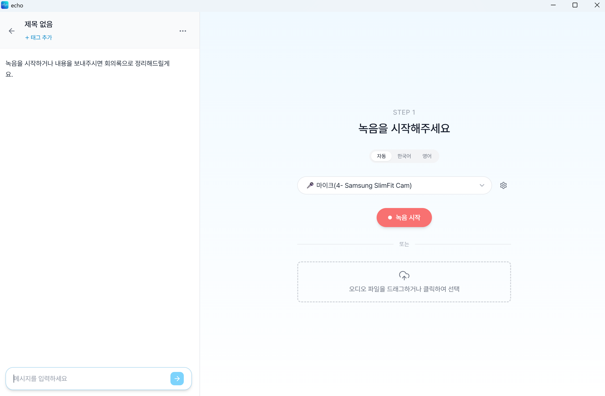 | 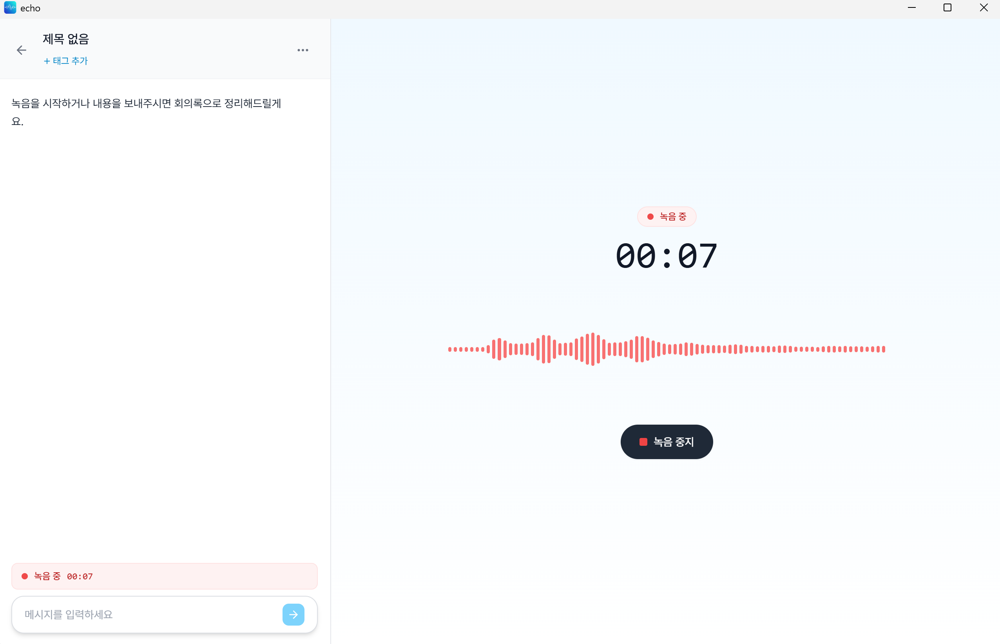 |

| Transcribing | Done |
|:-:|:-:|
| 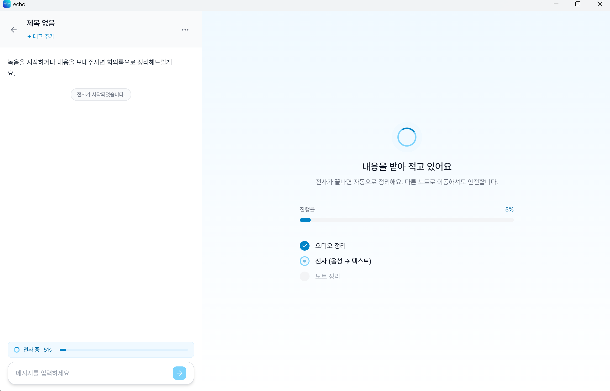 | 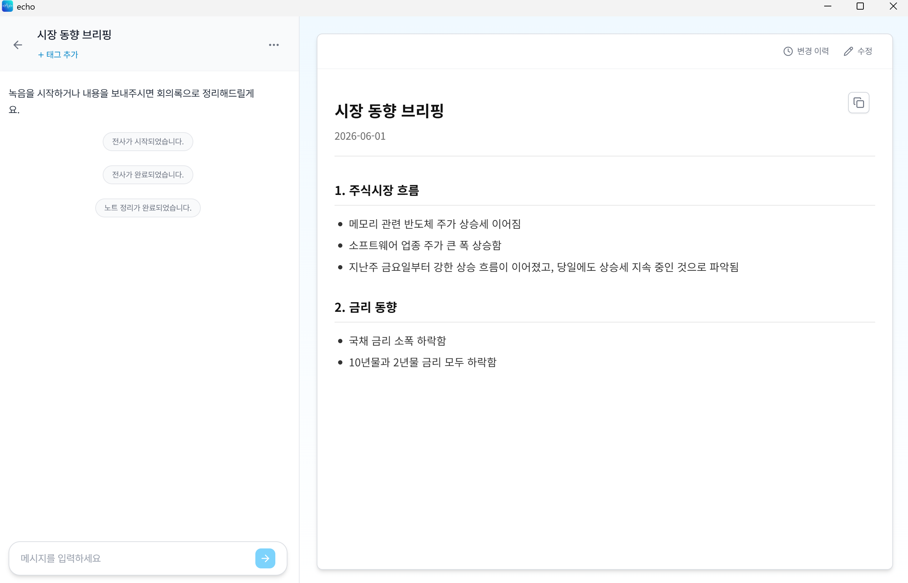 |

### 5.1 Record or import

- **Record** — pick the input source and press *Start recording*. A timer and waveform appear, and the chat header mirrors the progress. Press *Stop* and transcription begins shortly after. Moving to another note mid-recording is safe.
  - **Microphone** captures your PC mic (in-person meetings/lectures).
  - **System sound** captures what the computer plays (video calls, online lectures).
- **Import** — drag an existing recording onto the drop zone, or click to pick one. Importing auto-starts transcription.

### 5.2 Transcription & the write-up

After recording/import, **transcribe → organize** runs automatically (audio cleanup → transcribing, with a progress bar → organizing). Long audio can take 10+ minutes; you can browse other notes or minimize to the tray while it runs.

The result adapts to the input — decisions/actions and sections for a meeting, organized information for a lecture/briefing, a tight summary for a short monologue — and its length scales to how much there is.

If a transient AI-server error fails a step, a notice appears with **Retry** (or ask the agent "retry"). The agent won't retry on its own.

---

## 6. The note header (title & tags)

The header shows the note's **title** and its **tags** — nothing else to edit there.

The title is derived automatically from the **first line of the note body**, so you change the title by changing that first line (type it, or ask the agent "title it 'X'"). To organize notes, add `#tags` in the header (see §9).

---

## 7. Asking the AI agent

The chat on the left is where you talk to the agent in plain language.

| Ask | What it does |
|---|---|
| "Add a heading and group these" / "make it a table" / "as a timeline" | Restructures the note. |
| "Cut it to 10 lines" / "summarize this section" | Condenses. |
| "Tidy the wording" | Cleans up phrasing without changing structure. |
| "It's X', not X" | Corrects the wording in place and re-organizes. |
| "Title it 'Project kickoff'" | Sets the first line / title. |
| "Turn it into lecture notes" | Switches the note's genre/design (minutes). |
| "Retry the transcription" | Retries a failed task. |
| "Where is it now?" | Reports the note's current state. |

The agent knows which stage the note is in and suggests a sensible next step. When something is ambiguous it proposes options and confirms. After it changes the note body, an **Open this version** button appears beside that message so you can jump to exactly that version.

---

## 8. Viewing, editing & version history

- **View & copy** — the note body shows on the right; copy it as rich or plain text from the header menu.
- **Edit directly** — use *Edit* in the header to change the body by hand; your edits persist through later refinements.
- **History & revert** — *History* shows previous versions; *revert to this note* restores one as the new active version. Old versions are kept, so you can always go back again.
- **Back to start** — *Revert to the initial state* returns to the body right after the first organize, if you want to clear accumulated edits and restart.

---

## 9. Tags

Add `#tags` in the note header to classify notes.

- *Add tag* lets you type after `#`; existing tags autocomplete.
- Tags show in the order you add them; remove one with × on hover.
- A note's tags also appear on its card in the list.
- A tag left on no note is cleaned up automatically.

---

## 10. Search

In the list's search bar:

- **Text** — search title / memo / location keywords.
- **`#tag`** — type `#meeting` and confirm with **Enter/Space** to make a chip; only notes with that tag remain. Several tags are AND-matched. Remove chips with × or Backspace.
- Mix text and tags freely (e.g., `kickoff #project`).

---

## 11. Settings (AI models · language · audio)

Open Settings from the top bar / list.

| | |
|:-:|:-:|
| 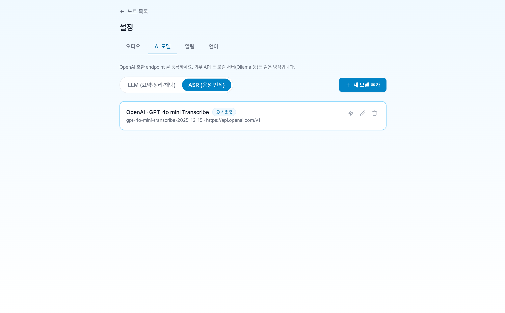 | 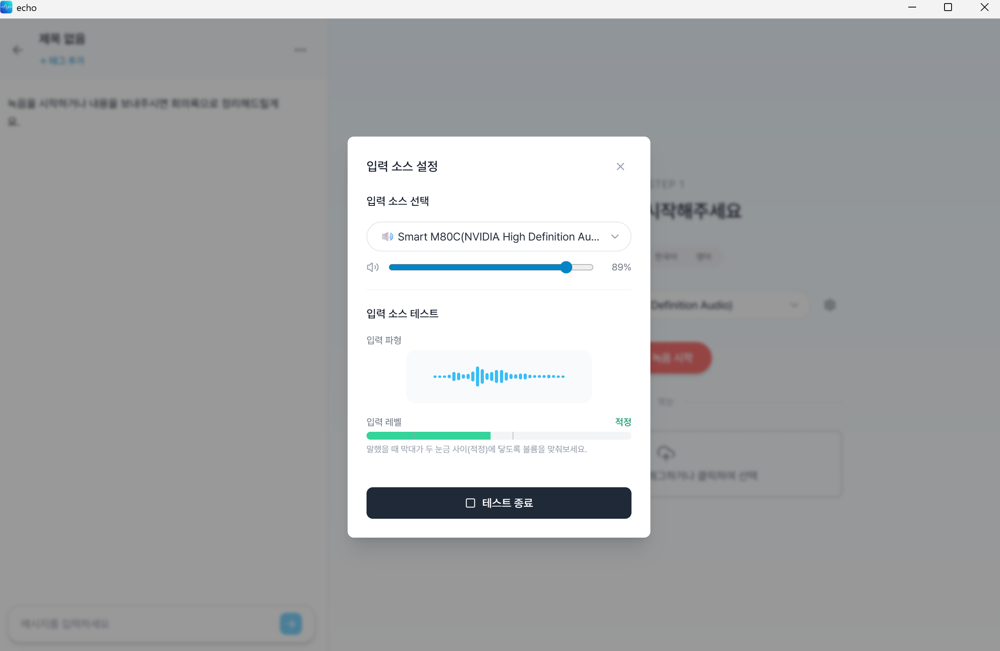 |

- **AI models** — register and switch your OpenAI-compatible **ASR** and **LLM** endpoints. Cloud API key or local server.
- **Language** — switch the UI and AI output language (Korean / English).
- **Audio** — pick and test your input source (waveform & level), and adjust the OS input volume.

---

## 12. FAQ

**Q. I started recording but the waveform isn't moving.**
A. Check and test the input source under Settings → Audio, and verify your OS input device and permission.

**Q. I'm in system-sound mode but nothing is recorded.**
A. Confirm system output is the capture target using the test in Settings.

**Q. Transcription is taking a while — can I do other things?**
A. Yes. Moving to another note or minimizing to the tray keeps the work running.

**Q. The note result isn't quite right.**
A. Ask the agent: "shorter", "make a table", "turn it into lecture notes", "tidy the wording". Fix a mistaken word with "it's X', not X".

**Q. I attached a recording and sent it, but nothing changed in the note.**
A. Make sure an **ASR** and **LLM** endpoint are registered in Settings — transcription and organizing need both.

**Q. How do I connect an AI model?**
A. In Settings → AI models, register OpenAI-compatible endpoints for ASR and LLM — a cloud API key, or a local server like vLLM.

**Q. Where is my data stored?**
A. In a local SQLite database in your app-data folder. No account, no server; the only thing that leaves your machine is the calls to the AI endpoints you registered.

**Q. I created a note by mistake.**
A. Delete it from the chat's overflow menu (*Delete note*). Its recordings, transcripts, and note bodies are all removed from disk.
